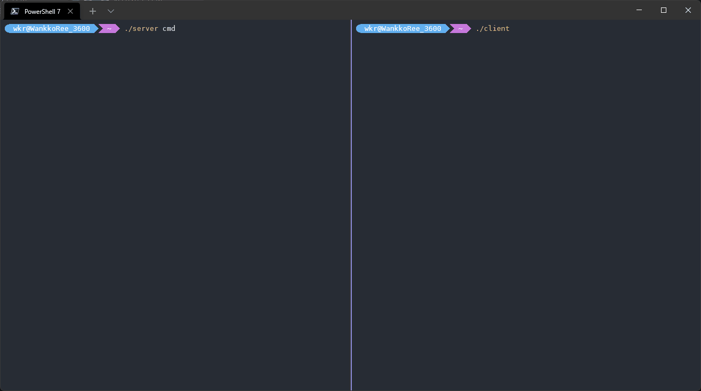

# WatchDoger

**WatchDog in Docker**

- 使用`Golang`实现的 **可交互命令行** 本机传递工具。
- 全程使用本机`127.0.0.1`网络，无需外网与web，更不需要导出端口。
  > 对标`GoTTY`了属于是……



## 适用情境

当你在`Docker`容器中运行了一个需要输入输出的可交互命令（如[mirai-console-loader]( https://github.com/iTXTech/mirai-console-loader )），你只能望着日志干瞪眼，或者冒着`Docker`容器被你退出时顺手玄学关闭的风险执行`docker attach`。

但是现在，你可以选择在你的`Docker`容器中加入`WatchDoger`，只需要在原本的启动命令行前加上`server`，即可通过`docker exec`进入`Docker`容器执行`client`来连接到目标命令行。

## 使用

1. `Docker`容器启动时用`server`启动目标`"bash"`

   如在`docker-compose.yml`的`command`下将原来的可交互命令之前加上`server `即可。

   ```yaml
   version: "3"
   services:
     demo:
       container_name: demo
       image: alpine:latest
       command: /bin/bash -c "chmod +x ./demobsah && chmod +x ./server && chmod +x ./client && ./server ./demobsah demoArg1 /demoArg2 -demoArg3"
   ```

2. 需要交互时进入`Docker`容器开启`client`连上`server`

   - 通过`/bin/bash`进入`client`
   ```shell
   docker exec -it demo bash
   root@demo:~# ./client
   > 2022/03/12 21:08:08 建立连接成功
   #在这开始你的正常交互吧
   ```
    - 直接进入`client`
   ```shell
   docker exec -it demo ./client
   > 2022/03/12 21:08:08 建立连接成功
   #在这开始你的正常交互吧
   ```

## 最佳实践

- [SchoolPowerCrawlerAndDisplayor](https://github.com/WankkoRee/SchoolPowerCrawlerAndDisplayor) 的`school_power_mirai`容器部分。

## Q&A

- `server`端的使用是直接在原来的可交互命令前加上`server `吗？
  - 是的，如果有遇到某些参数无法传入的情况，请提交`issue`。
- 运行提示`Permission denied`怎么办？
  - 请确保`server`、`client`、目标命令 有可执行权限，具体可参考上方demo中的`chmod +x`。
- 只能在`Docker`环境中使用吗？
  - 并不是，只是`Docker`环境的需求比较典型而已，你有其他类似的需求也可以使用本项目。
- 你的文档写的好拉，我看了还是用不来怎么办？
  - 尝试用`Docker`启动一个`/bin/bash`，然后去测试吧！
- 我启动了`client`并显示`建立连接成功`但是为什么无法交互？
  - 请检查`server`日志，是否有已经在交互中的`client`，如有请前往对应`client`或等待对应`client`关闭。
  - 本项目为减少一些不必要的bug（如交叉回显、同时输入等在非`Docker`情境下不可能出现的情况），同一时刻只支持一个`client`连接到`server`，其他客户端会排队等待连接。
